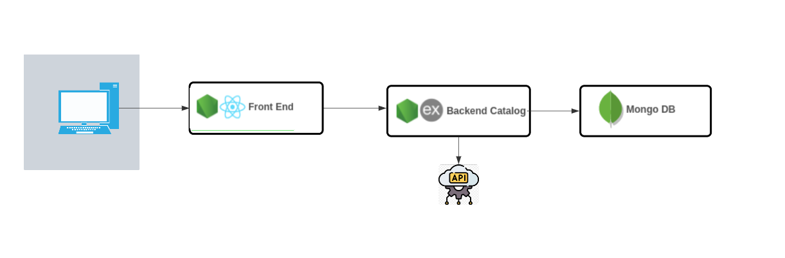

# Case_Pipo_Saude

## Arquitetura.

- *Arquitetura Centralizada:* Todo o código backend (rotas, controladores, modelos) está dentro de uma única aplicação Node.js/Express. A aplicação lida com várias funcionalidades, como gerenciamento de funcionários e benefícios, dentro de um único código base.
*Banco de Dados Centralizado:* A aplicação se conecta a um único banco de dados MongoDB, onde todas as informações são armazenadas.
*Implantação Unificada:* Todo o sistema é implantado como uma única unidade. Isso significa que quando e feita uma atualização ou correção de bug, todo o sistema é atualizado de uma vez.

## Entendendo o Problema.

#### Problema de Negócio:
- O processo atual de inclusão de novos funcionários nos benefícios de saúde das empresas é complicado e propenso a erros. A Pipo quer simplificar e automatizar esse processo, garantindo que apenas os dados necessários sejam coletados e validados.

#### Clientes e Benefícios:
- Acme Co: Oferece Plano de Saúde Norte Europa e Plano Dental Sorriso.
- Tio Patinhas Bank: Oferece Plano de Saúde Pampulha Intermédica, Plano Dental Sorriso e Plano de Saúde Mental Mente Sã, Corpo São.

#### Decisões Técnicas:

Para implementar o case específico optei por utilizar a  MERN Stack (MongoDB, Express, React, Node.js).

- 1. MongoDB: Um banco de dados NoSQL que armazena dados em documentos JSON flexíveis.
- 2. Express.js: Um framework web para Node.js, usado para construir a lógica de back-end e gerenciar rotas e servidores.
- 3. React.js: Uma biblioteca JavaScript usada para criar interfaces de usuário dinâmicas e interativas no front-end.
- 4. Node.js: Um ambiente de execução JavaScript no lado do servidor, que permite que o JavaScript seja usado para programar o back-end.

- Backend: API para gerenciar a inclusão dos funcionários nos benefícios.
- Frontend: Interface para o RH da empresa inserir os dados dos funcionários.
- Banco de Dados: Armazenar dados dos funcionários e benefícios.
- Mui material para estilização

## Frontend (React):

- Um formulário dinâmico que coleta dados do funcionário com base nos benefícios selecionados.
- Validação de dados no frontend antes do envio ao backend.

#### Backend (Node.js + Express):

- Endpoints para receber e validar dados do funcionário.
- Lógica para determinar quais campos são necessários com base nos benefícios oferecidos.
- Armazenamento dos dados no MongoDB.

#### Script de Seeding: 

- Para inserir os benefícios no banco de dados MongoDB, criei um script de seeding que insere os benefícios diretamente no banco. Isso é feito fora do fluxo normal da aplicação, normalmente como uma tarefa única para configurar o banco de dados com dados iniciais.

- Abrir o terminal na raiz do seu projeto.
- Executar o script com o Node.js:
-       node seedBeneficios.js
-  use o MongoDB Shell (linha de comando) para listar os documentos:
-         mongo
        use <nome-do-seu-banco-de-dados>
        db.beneficios.find().pretty()

#### Banco de Dados (MongoDB):

- Criei um Cluster no MongoDb Atlas

- Funcionarios: Armazena os dados dos funcionários.
- Beneficios: Define quais campos são necessários para cada benefício e cliente.

## Configurando o Backend:

#### Inicializando o projeto Node.js
-  npm init -y

#### Instalação de Dependências:

-  npm install express mongoose cors body-parser dotenv

- Express: Framework para criar o servidor.
- Mongoose: ODM para MongoDB.
- Cors: Middleware para permitir requisições entre diferentes origens (Cross-Origin).
- Body-Parser: Middleware para parsear o corpo das requisições.
- Dotenv: Para gerenciar variáveis de ambiente.

#### Instação o axios para fazer requisições à API:

- npm install axios

#### Estrutura de Pastas:
-   config controllers models routes

#### Arquivo .env

- MONGO_URI: String de conexão com o MongoDB.
- PORT: Porta onde o servidor será executado.

#### Para rodar o backend:

-  node server.js

#### Para rodar o frontend:

- npm start

# MELHORIAS FUTURAS:

## Tela de vizualização:

Implementar tela de visualização, para ver os dados gravados.

## Upload de Documentos:

Permitir que os usuários façam upload de documentos necessários (como RG, CPF, comprovante de residência) diretamente no formulário de inclusão de funcionários.

## Painel de Administração:

Desenvolver um painel administrativo onde os RHs possam gerenciar benefícios, funcionários, e visualizar relatórios com métricas importantes.

## Notificações Automáticas:

Implementar um sistema de notificações que avise os usuários e o RH sobre a inclusão de novos funcionários, prazos de benefícios, ou qualquer outro evento importante.

## Integração com APIs de Parceiros:

Integrar a aplicação com as APIs dos parceiros de benefícios (como planos de saúde e odontológicos) para automatizar ainda mais o processo de inclusão e atualização de dados.

## Acessibilidade e Responsividade:

- Melhorar a acessibilidade da aplicação, garantindo que pessoas com deficiência possam utilizá-la sem dificuldades.

## Internacionalização (i18n):

- Preparar a aplicação para suportar múltiplos idiomas, considerando a possibilidade de a Pipo Saúde expandir suas operações para outros países.